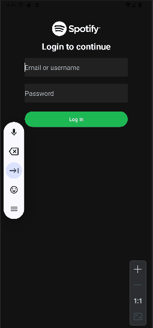

<!-- (This is a comment) INSTRUCTIONS: Go through this page and fill out any **bolded** entries with their correct values.-->

# AND101 Lab 3 - Spotify Login Screen UI

Submitted by: **Fienna Angeline**

Time spent: **1.5** hours spent in total

## Summary

**SpotifyClone** is an android app that mirrors the Spotify login page with buttons and colors somewhat identical

If I had to describe this project in three (3) emojis, they would be: 🎵🎨⚙️

## Application Features

<!-- (This is a comment) Please be sure to change the [ ] to [x] for any features you completed.  If a feature is not checked [x], you might miss the points for that item! -->

The following REQUIRED features are completed:

- [x] Created a username textedit
- [x] Created a password textedit
- [x] Created a login button

The following STRETCH features are implemented:

- [x] Edit colors of app to reflect spotify
- [x] Add Spotify Logo

The following EXTRA features are implemented:

## Video Demo

Here's a video / GIF that demos all of the app's implemented features:

GIF created with **ScreenToGif**

<!-- Recommended tools:
- [Kap](https://getkap.co/) for macOS
- [ScreenToGif](https://www.screentogif.com/) for Windows
- [peek](https://github.com/phw/peek) for Linux. -->

## Notes

## License

Copyright **2025** **Fienna Angeline**

Licensed under the Apache License, Version 2.0 (the "License");
you may not use this file except in compliance with the License.
You may obtain a copy of the License at

    http://www.apache.org/licenses/LICENSE-2.0

Unless required by applicable law or agreed to in writing, software
distributed under the License is distributed on an "AS IS" BASIS,
WITHOUT WARRANTIES OR CONDITIONS OF ANY KIND, either express or implied.
See the License for the specific language governing permissions and
limitations under the License.
